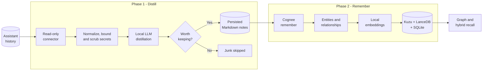
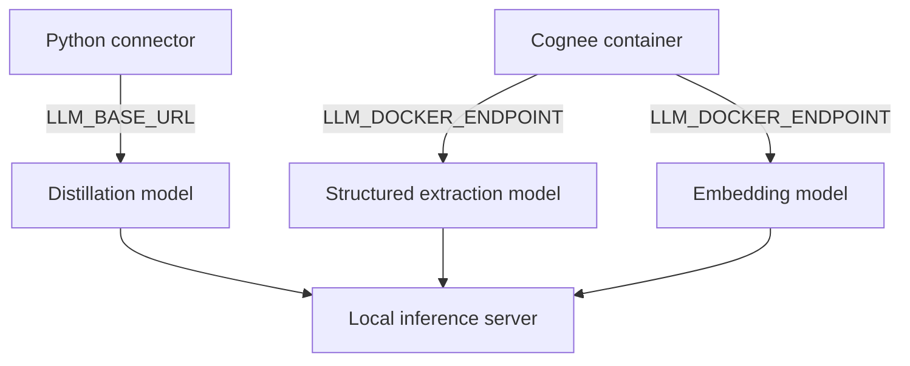

<div align="center">

# cognee-backfill

### Distill years of AI coding history into durable, local-first memory.

Extract the decisions, fixes, workflows, and gotchas worth keeping.<br>
Skip the chatter, aborted attempts, reasoning traces, and raw log noise.

[](https://www.python.org/)
[](https://www.docker.com/)
[](https://github.com/topoteretes/cognee)
[](#local-models)
[](LICENSE)

**[Quick start](#quick-start)** · **[How it works](#how-it-works)** · **[Technical wiki](https://github.com/thomasmaerz/cognee-backfill/wiki)** · **[Connector roadmap](#connector-roadmap)**

</div>

---

`cognee-backfill` converts coding-assistant session history into a compact
[Cognee](https://github.com/topoteretes/cognee) knowledge graph. It does not
blindly embed every message. Each session is first distilled by a local LLM;
only durable knowledge is passed to Cognee for graph extraction, embeddings,
and recall.

> **Current connector:** OpenCode SQLite history. The pipeline is designed for
> additional connectors, including Claude Code, Cursor, Cline, and generic
> JSONL exports.

## How it works



### Why distill first?

| Naive transcript indexing | `cognee-backfill` |
|---|---|
| Embeds greetings, false starts, and log dumps | Keeps decisions, fixes, patterns, and project context |
| Lets tool output dominate retrieval | Bounds every field and samples long sessions intelligently |
| Stores raw reasoning traces | Produces concise, structured knowledge notes |
| Reprocesses everything after interruption | Persists notes and progress for lossless resume |
| Risks sending secrets downstream | Scrubs common credentials before the LLM boundary |

## Quick start

### 1. Prerequisites

- Python 3.10+
- Docker with Compose
- A local OpenAI-compatible inference server
- One chat model and one embedding model loaded

Tested with [oMLX](https://github.com/jundot/omlx). Ollama, LM Studio, and
vLLM work when their OpenAI-compatible endpoints accept the configured model
IDs and request extensions.

### 2. Start the local stack

```bash
git clone https://github.com/thomasmaerz/cognee-backfill.git
cd cognee-backfill

cp .env.example .env
# Edit .env: set LLM_API_KEY and confirm model IDs/endpoints.

docker compose up -d
curl -f http://localhost:8010/health
```

| Service | URL |
|---|---|
| Cognee UI | http://localhost:3010 |
| Cognee API | http://localhost:8010 |
| Swagger API docs | http://localhost:8010/docs |

The bundled UI uses the local-development credentials
`default_user@example.com` / `default_password`. Keep this stack bound to
localhost unless you replace that development posture.

### 3. Inspect and smoke-test the source

```bash
export LLM_BASE_URL=http://127.0.0.1:8000
export LLM_API_KEY='your-local-server-key'

python3 backfill.py --stats

# Test only three sessions in an isolated dataset.
python3 backfill.py \
  --limit 3 \
  --dataset kb_smoke \
  --recall "What durable decisions appear in these sessions?"
```

Review the generated notes in `var/distilled/` and delete the smoke dataset
before starting the complete run.

### 4. Run the resumable backfill

```bash
nohup python3 backfill.py --dataset knowledge_base \
  > backfill.log 2>&1 < /dev/null &
echo $! > backfill.pid

nohup ./monitor.sh >/dev/null 2>&1 < /dev/null &
echo $! > monitor.pid
```

Stop and restart the same command at any time. Accepted notes are persisted to
`var/distilled/<session-id>.md`; `progress.json` records pipeline state.

### 5. Enrich and verify

After Cognee reports that all documents completed processing:

```bash
python3 backfill.py \
  --dataset knowledge_base \
  --improve \
  --recall \
    "Which authentication decisions were made?" \
    "Which recurring failures have known fixes?"
```

See the **[Operations guide](https://github.com/thomasmaerz/cognee-backfill/wiki/Operations)**
for monitoring, backups, cleanup, and verification criteria.

## Pipeline guarantees

| Guarantee | Implementation |
|---|---|
| Source isolation | SQLite is opened with `mode=ro`; connectors never mutate history |
| Resume safety | Notes reach disk before their state becomes `distilled` |
| Explicit junk filtering | Only an exact model response of `JUNK` is discarded |
| Retryable failures | Distillation and submission errors remain eligible for retry |
| Secret defense-in-depth | Common keys, tokens, passwords, and private-key markers are redacted |
| Local-first execution | LLM, embeddings, graph, vectors, and metadata can stay on one machine |

## Local models

The connector and Cognee use the same local OpenAI-compatible server by
default, but route their requests independently:



Reasoning-capable Qwen models require a hard thinking-mode switch for reliable
schema output. The connector sends
`chat_template_kwargs.enable_thinking=false`, while Cognee forwards the same
setting through `LLM_ARGS`. Read the
**[thinking-preamble guide](https://github.com/thomasmaerz/cognee-backfill/wiki/Thinking-preamble)**
before changing model families.

### Core configuration

| Variable / flag | Default | Purpose |
|---|---|---|
| `LLM_BASE_URL` | `http://127.0.0.1:8000` | Inference server as seen by the connector |
| `LLM_DOCKER_ENDPOINT` | `http://host.docker.internal:8000/v1` | Same server as seen by Cognee |
| `LLM_API_KEY` | none | Local server bearer token |
| `DISTILL_MODEL` / `--model` | Qwen3.6-35B-A3B MLX alias | Session distillation model |
| `DISABLE_THINKING` | `true` | Send the Qwen-compatible hard switch |
| `COGNEE_API_URL` | `http://localhost:8010` | Cognee API endpoint |
| `OPENCODE_DB` | `~/.local/share/opencode/opencode.db` | Read-only OpenCode source |
| `--concurrency` | `4` | Parallel distillation workers |
| `--limit`, `--offset` | unset | Smoke testing and manual sharding |

The complete model, embedding, and structured-output matrix lives in
**[Configuration](https://github.com/thomasmaerz/cognee-backfill/wiki/Configuration)**.

## Technology stack

| | Technology | Responsibility |
|:---:|---|---|
|  | **Python 3.10+** | Dependency-free connector, checkpoint state, and HTTP client |
|  | **Docker Compose** | Reproducible Cognee API and web UI |
| 🧠 | **Cognee** | Knowledge extraction, enrichment, provenance, and recall |
|  | **SQLite** | OpenCode history and Cognee relational metadata |
| 🕸️ | **Kuzu** | Embedded knowledge graph |
| 🧭 | **LanceDB** | Embedded vector index |
|  | **OpenAI-compatible API** | Local model transport for chat and embeddings |

## Connector roadmap

| Connector | Status | Source format |
|---|:---:|---|
| **OpenCode** | ✅ Available | `session` / `message` / `part` SQLite tables |
| Claude Code | 🛠 Planned | `~/.claude/projects/` JSONL |
| Cursor / Windsurf | 🛠 Planned | Agent transcript exports |
| Cline / Continue | 🛠 Planned | Extension storage / exports |
| Generic JSONL | 🛠 Planned | Normalized external ETL format |

Every connector follows the same contract:

```text
extract read-only history -> normalize and scrub -> distill -> persist -> submit
```

See **[Adding a connector](https://github.com/thomasmaerz/cognee-backfill/wiki/Adding-a-connector)**
for the interface, fixtures, invariants, and acceptance criteria.

## Live capture after the backfill

Historical ingestion and ongoing memory are separate concerns. After the
backfill, Cognee's OpenCode plugin can capture new sessions and bridge them
into the same dataset:

```json
{
  "plugin": [
    [
      "file:/path/to/cognee-opencode",
      {
        "baseUrl": "http://localhost:8010",
        "datasetName": "knowledge_base"
      }
    ]
  ]
}
```

Build the plugin from
[`topoteretes/cognee-integrations`](https://github.com/topoteretes/cognee-integrations/tree/main/integrations/opencode),
then restart OpenCode.

## Documentation

| Guide | Covers |
|---|---|
| **[Architecture](https://github.com/thomasmaerz/cognee-backfill/wiki/Architecture)** | Data flow, state machine, storage, and failure boundaries |
| **[Configuration](https://github.com/thomasmaerz/cognee-backfill/wiki/Configuration)** | Models, embeddings, ports, concurrency, and persistence |
| **[Operations](https://github.com/thomasmaerz/cognee-backfill/wiki/Operations)** | Smoke tests, launch, monitoring, pause/resume, backup, cleanup |
| **[OpenCode connector](https://github.com/thomasmaerz/cognee-backfill/wiki/OpenCode-connector)** | Source schema, transcript reconstruction, and known limits |
| **[Adding a connector](https://github.com/thomasmaerz/cognee-backfill/wiki/Adding-a-connector)** | Adapter contract and quality gates for future sources |
| **[Thinking preamble](https://github.com/thomasmaerz/cognee-backfill/wiki/Thinking-preamble)** | Safe structured extraction with reasoning-capable models |
| **[Security and privacy](https://github.com/thomasmaerz/cognee-backfill/wiki/Security-and-privacy)** | Source isolation, scrubbing, network boundaries, retention |

## Security

Session history is sensitive. Keep the inference server, Cognee API, and UI
local unless you add authentication, TLS, explicit CORS origins, and firewall
controls. Regex scrubbing is defense-in-depth, not a complete DLP system.

Read **[Security and privacy](https://github.com/thomasmaerz/cognee-backfill/wiki/Security-and-privacy)**
before processing regulated or organization-confidential data.

## License

MIT. See [LICENSE](LICENSE). Cognee is licensed separately under Apache-2.0.
